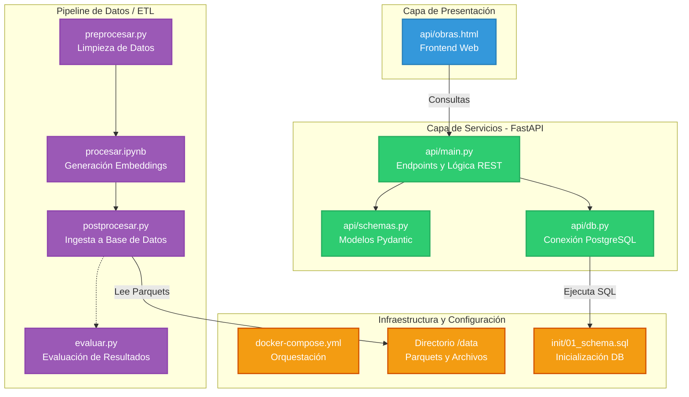
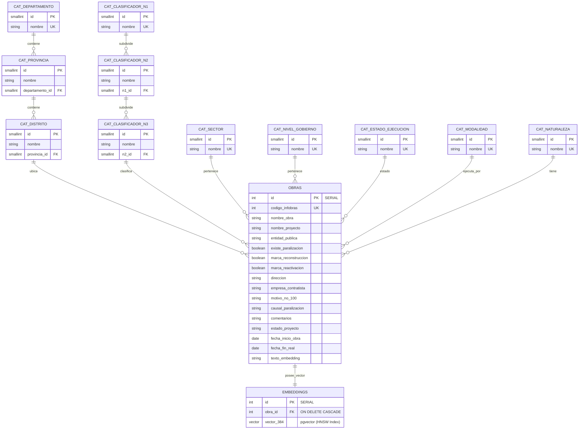

# Documentación de Arquitectura: Estructura del Proyecto y Base de Datos (pgvector)

Este documento describe la arquitectura integral del sistema, dividida en la organización de los componentes de software (Pipeline ETL y API) basada en el directorio del proyecto, y el modelo de datos relacional/vectorial estructurado en PostgreSQL con pgvector.

## 1. Arquitectura de Software (Pipeline y API)

### Explicación de la Arquitectura de Software

La disposición de los archivos refleja una separación clara de responsabilidades:

* **Pipeline de Datos (Raíz del proyecto):** Los scripts `preprocesar.py`, `procesar.ipynb` y `postprocesar.py` conforman el flujo secuencial ETL (Extracción, Transformación, Carga). Toman los archivos crudos del directorio `data/`, construyen los vectores y los inyectan en la base de datos. `evaluar.py` se encarga de medir el rendimiento de estas operaciones.
* **Capa de Servicios (`api/`):** Contiene el núcleo de la aplicación web (FastAPI). `main.py` expone los servicios, `schemas.py` valida las entradas/salidas, y `db.py` administra el *pool* de conexiones hacia PostgreSQL. Incluye también `obras.html` como interfaz ligera de consumo.
* **Infraestructura (`init/` y Raíz):** Orquestación mediante `docker-compose.yml`, dependencias en `requirements.txt` y la definición inicial de la base de datos en `01_schema.sql`.

---

## 2. Diagrama de Entidad-Relación (ERD)

### Explicación del Modelo de Base de Datos

El esquema SQL `01_schema.sql` define un modelo de estrella/copo de nieve optimizado para recuperación vectorial (RAG):

* **Tablas de Catálogo Jerárquicas:** Se estructuran niveles de dependencia para ubicaciones (Departamento -> Provincia -> Distrito) y clasificaciones de obra (N1 -> N2 -> N3), utilizando restricciones `UNIQUE` compuestas para mantener la integridad de los datos jerárquicos.
* **Optimización de Espacio:** Todos los catálogos utilizan identificadores `SMALLINT` (`SMALLSERIAL`), reduciendo drásticamente el peso de almacenamiento de la tabla central `obras`, la cual posee llaves foráneas apuntando a todos estos catálogos.
* **Tabla Principal (`obras`):** Concentra la metadata y llaves foráneas de la obra, usando un `codigo_infobras` como identificador de negocio único.
* **Aislamiento del Embedding (`embeddings`):** Se separa la representación matemática (`vector(384)`) en su propia tabla. Esto mejora el rendimiento general del motor relacional. Posee un índice `HNSW` con similitud coseno (`vector_cosine_ops`) que acelera las búsquedas aproximadas de alta dimensionalidad.
