# Documentación del Pipeline de Postprocesamiento: Migración a PostgreSQL Vectorial (pgvector)

Este documento expone la arquitectura del pipeline de ingestión que consolida los datos relacionales (Atributos de Obras) y los datos vectoriales (Embeddings Semánticos) en una base de datos **PostgreSQL** habilitada con la extensión **`pgvector`**.

## Arquitectura del Pipeline de Base de Datos

El diagrama modela la lógica transaccional, el mecanismo de almacenamiento en caché y la inserción masiva:

```mermaid
graph TD
    %% Estilos de los nodos
    classDef inicio_fin fill:#2c3e50,stroke:#34495e,stroke-width:2px,color:#fff;
    classDef proceso fill:#3498db,stroke:#2980b9,stroke-width:1px,color:#fff;
    classDef bd fill:#f39c12,stroke:#d35400,stroke-width:1px,color:#fff;
    classDef optimizacion fill:#2ecc71,stroke:#27ae60,stroke-width:1px,color:#fff;

    F1_Start([Inicio: Variables de Entorno y Configuración]) --> F2_Load[Fase 1: Carga de Datos desde Parquet]
    
    F2_Load --> F2_Data[Obras_df + Embeddings_df]
    F2_Data --> F3_Conn[Fase 2: Conexión Segura a PostgreSQL con Psycopg2]
    
    F3_Conn --> F4_Cat[Fase 3: Migración y Normalización de Catálogos]
    
    subgraph Normalizacion_Cache [Lógica de Normalización y Caché - Upsert]
        F4_Cat --> F4_Cache{¿Existe en Caché RAM?}
        F4_Cache -- Sí --> F4_Return[Retornar ID Foreign Key]
        F4_Cache -- No --> F4_SQL[Ejecutar UPSERT en DB y cachear]
        F4_SQL --> F4_Return
    end
    
    F4_Return --> F5_Merge[Merge de Atributos y Vectores por Código]
    F5_Merge --> F5_InsertObj[Fase 4: Inserción Masiva de Obras en Lotes]
    
    subgraph Pipeline_Transaccional [Pipeline Transaccional - Batch 500]
        F5_InsertObj --> F5_Execute[execute_values: Tabla 'obras']
        F5_Execute --> F6_Fetch[Recuperar Serial IDs reales de PostgreSQL]
        F6_Fetch --> F7_Map[Construcción del Índice: Código INFOBRAS -> obra_id]
    end
    
    F7_Map --> F8_Vector[Fase 5: Vinculación e Inserción Vectorial]
    F8_Vector --> F8_PgVector[execute_values: Tabla 'embeddings' como Tipo ::vector]
    
    F8_PgVector --> F9_Commit[Commit Transaccional]
    F9_Commit --> F10_End([Fin: Base de Datos Lista para RAG])

    class F1_Start,F10_End inicio_fin;
    class F2_Load,F3_Conn,F4_Cat,F5_Merge proceso;
    class F4_SQL,F5_Execute,F6_Fetch,F8_PgVector bd;
    class F4_Cache,F7_Map optimizacion;
```

---

## Análisis Detallado por Fase

### Fase 1: Ingesta Dual y Preparación del Entorno

El script inicializa cargando las variables de entorno (`dotenv`) para proteger las credenciales de la base de datos (Usuario, Password, Host).

* Se leen los dos archivos generados en fases anteriores: el `DataSet-Obras-Publicas` (atributos descriptivos) y el `embeddings_output` (tensores).
* Implementa una validación dinámica `cols_exist` para asegurar que el script no falle si el dataset original cambia su esquema (Agilidad estructural).

### Fase 2: Conexión y Control Transaccional

Utiliza la librería `psycopg2` para establecer la conexión a la instancia PostgreSQL.

* Deshabilita el auto-commit (`conn.autocommit = False`). Esto es una medida crítica de consistencia (ACID): asegura que si la inserción de 100,000 registros falla en el registro 99,999, toda la operación se deshace (Rollback), evitando estados inconsistentes o catálogos a medias en la base de datos.

### Fase 3: Arquitectura de Normalización mediante Diccionarios de Caché

El diseño relacional exige que campos repetitivos (ej. Departamentos, Provincias, Sectores) se externalicen en tablas de catálogo (Foreign Keys) para ahorrar espacio y mejorar las consultas.

* **Mecanismo `get_or_create`:** Para evitar bombardear la base de datos con millones de consultas `SELECT` individuales, el script mantiene un diccionario en RAM (`cache`).
* **Estrategia UPSERT:** Si un catálogo no existe en la RAM, ejecuta una inserción condicional en PostgreSQL (`INSERT ... ON CONFLICT DO NOTHING`), recupera la llave primaria (ID) recién creada, y la almacena en el caché de memoria. Las consultas subsecuentes para ese mismo departamento/sector se resuelven en microsegundos sin tocar la red.

### Fase 4: Volcado de Obras (Batch Insertions)

En lugar de insertar fila por fila (lo cual saturaría el canal de red), el script agrupa las inserciones en lotes de 500 registros (`BATCH = 500`).

* Emplea la función optimizada `execute_values` de `psycopg2.extras` que compila las 500 filas en una única instrucción SQL extendida (`VALUES (1...), (2...), (3...)`).
* **Sincronización de Identidad (`codigos_idx`):** Como PostgreSQL genera las llaves primarias dinámicamente (`SERIAL` / `id`), el script usa la cláusula `RETURNING id, codigo_infobras` para mapear de vuelta el `id` interno de la base de datos con el código del dataset público.

### Fase 5: Ingesta de Tensores y Casteo PgVector

La etapa final integra el modelo analítico dentro de la infraestructura relacional.

* Utiliza el índice construido (`codigos_idx`) para emparejar cada vector (una matriz de 384 números flotantes) con su obra correspondiente.
* **Casteo Directo a Nivel Motor:** Durante la inserción masiva de los embeddings, utiliza el *template* `(%s, %s::vector)`. Ese `::vector` es una directiva específica del motor de PostgreSQL (proporcionada por la extensión **`pgvector`**) que transforma la lista estándar de Python en un tipo de dato binario optimizado para cálculos de distancia hiperespacial (Coseno o Euclidiana) directamente dentro del disco de la base de datos, posibilitando búsquedas semánticas (RAG) ultra rápidas a través de SQL puro.
