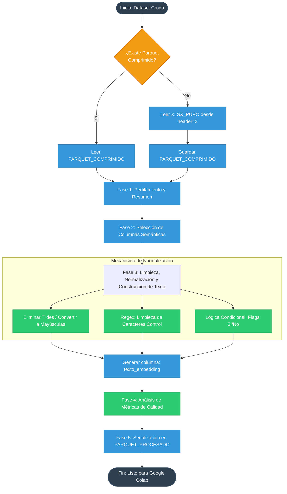

# Documentación del Pipeline de Preprocesamiento: Dataset de Obras Públicas

Este pipeline de datos en Python utiliza **Pandas** y **Pathlib** para transformar un conjunto de datos crudo de obras públicas (en formato Excel) en un archivo binario optimizado (**Parquet**) estructurado específicamente para alimentar modelos de procesamiento de lenguaje natural (NLP) y generación de *embeddings*.

## Arquitectura del Pipeline

El siguiente diagrama de flujo detalla la transición de los datos a lo largo de las 6 fases del script:

---

## Análisis Detallado por Fase

### Fase 0: Carga Estructurada y Caché de Datos
El script implementa un mecanismo de persistencia temporal (caché) basado en el formato corporativo **Apache Parquet**. 
* **Ventaja:** La lectura inicial desde un archivo Excel (`.xlsx`) consume recursos significativos de CPU y memoria debido al parseo de estructuras XML de Microsoft. Al serializar el DataFrame crudo en un Parquet intermedio (`PARQUET_COMPRIMIDO`), las lecturas subsecuentes aumentan su velocidad hasta en un 90%, reduciendo además drásticamente el espacio en disco mediante compresión columnar (Snappy por defecto).
* **Configuración:** Se saltan las primeras 3 líneas del archivo Excel (`header=3`) para alinear correctamente los nombres de las columnas físicas.

### Fase 1: Perfilamiento Estructurado (Data Profiling)
La función `resumen_df` realiza un escaneo exhaustivo de la metadata del DataFrame actual, calculando de forma dinámica para cada variable:
1. **Tipo de dato subyacente (`dtype`):** Crucial para verificar que las columnas numéricas no se hayan parseado como texto.
2. **Tasa de valores nulos (`%_nulos`):** Mide la completitud del campo.
3. **Cardinalidad (`valores_unicos`):** Ayuda a identificar variables categóricas o identificadores únicos.
4. **Cálculo robusto de la Moda (`moda` y `freq_moda`):** Extrae el valor estadísticamente más frecuente truncándolo de forma segura a 15 caracteres para asegurar una visualización limpia en la terminal de comandos.

### Fase 2: Clasificación y Selección Semántica
No todas las columnas de una base de datos operativa aportan valor contextual a un modelo de lenguaje. El script realiza un filtrado selectivo dividiendo el esquema en tres categorías conceptuales:
* **`cols_mantener`:** Claves primarias primordiales (`Código INFOBRAS`) que servirán de enlace analítico (join keys) en bases de datos vectoriales.
* **`cols_semanticas`:** Atributos deterministas del objeto (ubicación geográfica, sectores gubernamentales, denominación oficial de la obra).
* **`cols_opcionales`:** Datos condicionales y observaciones libres que enriquecen semánticamente el registro solo si cuentan con datos válidos.

### Fase 3: Pipeline de Normalización Textual y Construcción del Prompt
Esta es la fase de mayor densidad lógica. Se implementa una arquitectura de transformación funcional compuesta por:

1. **`normalizar()`:** Utiliza la librería nativa `unicodedata` aplicando una descomposición canónica (`NFD`). Esto aísla los caracteres base de sus acentos gráficos (diacríticos), permitiendo filtrar y remover los acentos (`Mn` o *Mark, Nonspacing*) mediante listas por comprensión, consolidando finalmente el texto en mayúsculas sostenidas. Esto homogeneíza la entrada semántica eliminando variaciones de digitación.
2. **`limpiar()`:** Maneja excepciones de valores nulos, vacíos estructurales o cadenas genéricas como `"nan"` o `"no aplica"`, homogeneizándolos bajo el token por defecto `"NO ESPECIFICADO"`.
3. **`limpiar_comentario()`:** Aplica expresiones regulares avanzadas (`re`) para purgar texto libre. Aplana la estructura eliminando saltos de línea (`\n`, `\r`) y tabulaciones, aislando caracteres válidos mediante el rango estructurado ASCII y caracteres latinos extendidos (`[^\x20-\x7E\u00C0-\u024F]`).
4. **`construir_texto_embedding()`:** Actúa como una plantilla de inyección de texto (*prompt builder*). El método fusiona elementos deterministas y condicionales usando una gramática estructurada en lenguaje natural humano (ej. `"LA OBRA...", "DE NATURALEZA...", "UBICADA EN..."`). Esto permite que los modelos de representación vectorial (*text-embedding-models*) capturen de manera óptima las relaciones espaciales y operativas de las obras.

### Fase 4: Control de Calidad Analítico
Antes de proceder con la persistencia de salida, el script calcula métricas descriptivas sobre el string resultante:
* Cuantificación exacta de registros procesados frente a vacíos inesperados.
* Distribución física de los textos generados mediante longitudes mínimas, máximas y promedios medidos en caracteres. Esto es indispensable para validar que las descripciones no excedan el límite máximo de *tokens* (Context Window) del modelo embedding seleccionado (ej. `text-embedding-3-small` de OpenAI o variantes locales de Hugging Face).

### Fase 5: Serialización y Preparación para Entornos de Cómputo Nube
Para finalizar, el DataFrame resultante se simplifica manteniendo estrictamente dos columnas: la llave de identidad única (`Código INFOBRAS`) y la cadena unificada de texto contexturizada (`texto_embedding`). Se exporta usando codificación nativa en formato Parquet, dejándolo completamente preparado para ser importado de forma ágil desde cuadernos de ejecución remota como **Google Colab**, maximizando el rendimiento de transferencia de red y velocidad de lectura I/O en la GPU.