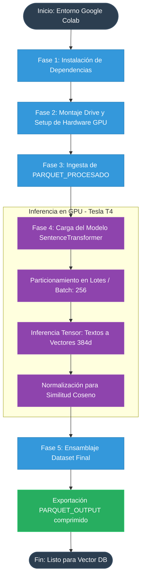

# Documentación del Pipeline de Procesamiento: Generación de Embeddings Vectoriales

Este documento detalla la arquitectura y el análisis técnico del cuaderno de Jupyter (Google Colab) encargado de la fase de procesamiento profundo (Deep Learning). El script transforma las descripciones semánticas normalizadas en **representaciones vectoriales densas (Embeddings)** utilizando modelos de procesamiento de lenguaje natural (NLP) acelerados por hardware (GPU).

## Arquitectura del Pipeline

El siguiente diagrama de flujo modela la ejecución secuencial del cuaderno y el ciclo de vida de la inferencia vectorial:

---

## Análisis Detallado por Fase

### Fase 1: Aprovisionamiento del Entorno Base
El pipeline inicia configurando el entorno de ejecución instalando el stack de librerías requeridas:
* **`sentence-transformers`:** El framework core basado en PyTorch y Hugging Face para instanciar el modelo de embeddings.
* **`pandas` y `pyarrow`:** Motores de manipulación de datos y motor I/O analítico de alto rendimiento indispensable para la lectura/escritura de formatos columnares complejos como Parquet.

### Fase 2: Conexión de Almacenamiento y Validación de Hardware
El script se enlaza de forma persistente con Google Drive para permitir el I/O de archivos masivos sin perder datos ante la desconexión del entorno efímero de Colab. 
* **Control de Aceleración:** Implementa una validación asíncrona mediante `torch.cuda.is_available()` para confirmar la asignación de aceleradores de hardware (ej. NVIDIA Tesla T4). El procesamiento de NLP sin GPU tomaría horas en lugar de minutos.

### Fase 3: Ingesta Optimizada de Datos en Memoria (RAM)
Se lee el archivo resultante de la etapa de preprocesamiento.
* **Optimización de Lectura:** Utiliza el argumento `columns=["Código INFOBRAS", "texto_embedding"]`. Al limitar explícitamente las columnas a cargar, minimiza la huella en memoria (RAM), reservando recursos vitales para la VRAM de la GPU durante la codificación.
* **Validación Temprana:** Verifica la existencia de las rutas antes de la carga para evitar colapsos silenciosos e imprime un extracto para validación visual de integridad.

### Fase 4: Motor de Inferencia Semántica Multilingüe
Es el núcleo analítico de la operación. Emplea la arquitectura Transformer para mapear los textos en un espacio vectorial.
1. **Selección del Modelo:** Emplea `paraphrase-multilingual-MiniLM-L12-v2`. Una elección técnica óptima que ofrece un equilibrio ideal entre velocidad, peso computacional y soporte robusto para el idioma español.
2. **Dimensiones Constantes:** El modelo proyecta el texto semántico a una matriz densa donde cada registro se traduce estrictamente a **384 dimensiones** continuas.
3. **Calibración del Batching:** Configurado dinámicamente con `batch_size=256`. Este tamaño maximiza el flujo de tensores (*throughput*) en los 16 GB de VRAM de la GPU T4 sin desencadenar excepciones de falta de memoria (OOM - *Out of Memory*).
4. **Normalización Cosinoidal:** Aplica `normalize_embeddings=True`, un parámetro vital. Convierte los vectores resultantes para que su magnitud sea 1, lo que permite que el cálculo matemático de distancia durante las futuras búsquedas semánticas utilice una simple multiplicación escalar (Dot Product / Cosine Similarity), reduciendo masivamente los costos computacionales de la Base de Datos Vectorial.

### Fase 5: Consolidación Dimensional y Serialización (Export)
El paso final toma los arrays matemáticos puros extraídos de la GPU y los reformatea para su distribución:
1. **Casteo de Precisión:** Trunca numéricamente el *output* convirtiendo la matriz a `float32`. Esto reduce a la mitad el peso del archivo frente al `float64` tradicional sin pérdida detectable de precisión en sistemas de recuperación de información.
2. **Alineación Relacional:** Ensambla un Dataframe columnar ancho (`v0`, `v1`... `v383`) y lo concatena a lo largo del Eje 1 (`axis=1`) garantizando la correspondencia 1:1 absoluta con la llave primaria `Código INFOBRAS`.
3. **Persistencia Final:** El resultado (matrices vectoriales pesadas de cientos de MB) se consolida en un único archivo serializado con codificación tipo Parquet y compresión *Snappy*, dejándolo estandarizado, altamente comprimido y listo para indexarse en infraestructuras de búsquedas RAG (Retrieval-Augmented Generation) o Bases de Datos Vectoriales.