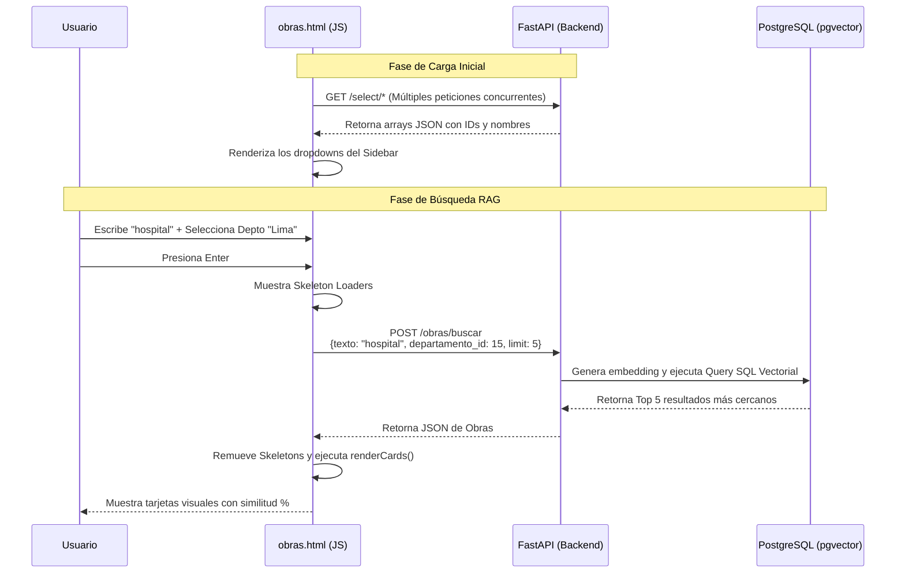

# Guía de Interfaz Gráfica y Comunicación de API

## 1. Guía de Interfaz Gráfica (UI / UX)

Tu interfaz está construida con un enfoque de **Dashboard Analítico** en modo oscuro (Dark Theme), ideal para herramientas técnicas y de búsqueda. No usa frameworks externos (como React o Bootstrap), todo es HTML/CSS/JS puro (Vanilla).

### Sistema de Diseño (Design System)
* **Paleta de Colores:** Basada en tonos oscuros (`#0b0f1a`, `#111827`) con bordes sutiles y un azul neón (`#3b82f6`) como color de acento (`--accent`) para destacar acciones y resultados.
* **Tipografía:** * `Space Mono`: Usada para etiquetas, códigos, metadatos y botones. Le da un aspecto técnico y de "terminal".
  * `DM Sans`: Usada para los textos de lectura, títulos de obras y párrafos para mantener la legibilidad.
* **Fondo (Background):** Un patrón de cuadrícula sutil (grid) creado con CSS gradients para darle profundidad técnica.

### Estructura (Layout)
El diseño utiliza `CSS Grid` y `Flexbox` para dividir la pantalla en tres zonas principales:
1. **Header (Cabecera):** Fija en la parte superior, con efecto de desenfoque (`backdrop-filter: blur`). Muestra el logo y versión.
2. **Sidebar (Barra Lateral Izquierda):** Contenedor pegajoso (`position: sticky`) que alberga todos los filtros, menús desplegables y toggles. Se mantiene visible mientras haces scroll en los resultados.
3. **Main (Contenido Principal):** El área derecha donde está el gran buscador (`#txtBusqueda`), la barra de estado y la cuadrícula (`.cards-grid`) donde se renderizan las obras. En móviles, el diseño colapsa a una sola columna.

### Componentes Interactivos
* **Skeleton Loaders:** Mientras la API responde, el sistema no se queda congelado. Muestra unas tarjetas "fantasma" (`.skeleton`) con una animación de brillo (`shimmer`) para indicar que está procesando.
* **Tarjetas de Obra (`.obra-card`):** Componentes con animación de entrada suave. Muestran el código INFOBRAS, porcentaje de similitud semántica, iconos descriptivos y etiquetas (tags) con colores semánticos (Rojo = Paralizada, Amarillo = Reconstrucción).
* **Modal de Detalle (`.modal-overlay`):** Al hacer clic en una tarjeta, se oscurece el fondo y aparece una ventana flotante con la información detallada de la obra, incluyendo una barra visual de progreso para la similitud.

---

## 2. Integración de APIs (Comunicación Frontend-Backend)

El archivo usa la API nativa `fetch` de JavaScript para comunicarse con tu backend (FastAPI). La constante `const API = '';` indica que el frontend espera ser servido desde el mismo dominio/puerto que tu backend.

Así es como fluye la información:

### A. Inicialización Paralela (Carga de Catálogos)
Al abrir la página, se ejecuta la función `init()`. En lugar de hacer las peticiones una por una (lo que sería lento), usa `Promise.all()` para disparar 7 peticiones `GET` al mismo tiempo y llenar los menús desplegables (comboboxes).
* **Endpoints consumidos:** `/select/departamentos`, `/select/sectores`, `/select/niveles-gobierno`, etc.

### B. Filtros en Cascada (Event Listeners)
El sistema tiene una lógica reactiva para los filtros jerárquicos.
* **Geografía:** Si seleccionas un Departamento, el evento `change` captura el ID y hace una petición `GET` dinámica a `/select/provincias?departamento_id={ID}` para llenar el siguiente menú y habilitarlo. Lo mismo ocurre de Provincia a Distrito.
* **Clasificador Institucional:** Sigue la misma lógica (Nivel 1 habilita Nivel 2, Nivel 2 habilita Nivel 3).

### C. El Motor de Búsqueda Semántica (`buscarObras()`)
Esta es la función principal que se activa al darle "Enter" en el buscador o clic en "BUSCAR".

1. **Recolección de Datos (Payload):** Lee el texto principal, la paginación (`limit` y `offset`) y usa funciones auxiliares (`addInt`, `addStr`, `addBool`) para barrer todos los filtros del Sidebar. Si un filtro está vacío, simplemente no lo envía, manteniendo el JSON limpio.
2. **Manejo de Estado:** Cambia la barra de estado a "loading", bloquea el botón para evitar doble envío de datos y renderiza los Skeleton Loaders.
3. **Petición POST:**
   ```javascript
   fetch('/obras/buscar', {
       method: 'POST',
       headers: { 'Content-Type': 'application/json' },
       body: JSON.stringify(body) 
   })
   ```
4. **Renderizado:** Una vez que FastAPI responde con el JSON de obras ordenadas por distancia vectorial, la función `renderCards()` las dibuja en el HTML y actualiza la paginación dinámica.

### Diagrama de Flujo (Frontend a Backend)

